# ROS 基础与环境搭建 Week2 实验报告

## 实验目的
通过本周学习，掌握 Linux 基本操作，完成 Python/C++ 开发环境配置，正确安装 ROS1 Noetic，理解 ROS 基础结构和通信机制，能够运行与控制 turtlesim，并掌握 launch 文件的基本使用。

## 实验环境
- **操作系统**: Ubuntu 20.04 LTS
- **ROS 版本**: ROS Noetic
- **Python 版本**: Python 3.8
- **C++ 编译器**: GCC 9.4.0

## 具体步骤与结果分析

### 任务1: Linux 基础命令练习

#### 具体步骤
1. **文件管理操作**：创建目录和文件，进行文件移动、重命名、查看内容等操作
2. **软件安装练习**：使用 apt 工具安装 htop 进程监控工具
3. **进程管理**：使用 ps 查看进程，kill 终止指定进程

#### 运行结果与分析
- **文件管理**：成功掌握 Linux 文件系统的基本操作命令
- **软件安装**：熟练使用 apt 包管理器进行软件安装和更新
- **进程管理**：理解 Linux 进程管理机制，能够有效监控和控制系统进程
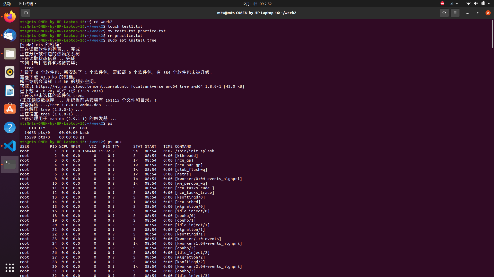
### 任务2: Python与C++编程练习

#### 编程内容
- **Python程序**：编写并运行 HelloWorld 程序
- **C++程序**：编写数字求和程序，掌握输入输出操作
- **开发环境**：配置 VSCode 调试环境

#### 运行结果
- 成功运行 Python 和 C++ 程序
- 掌握 GCC 编译器的基本使用方法
- 熟悉 VSCode 调试配置
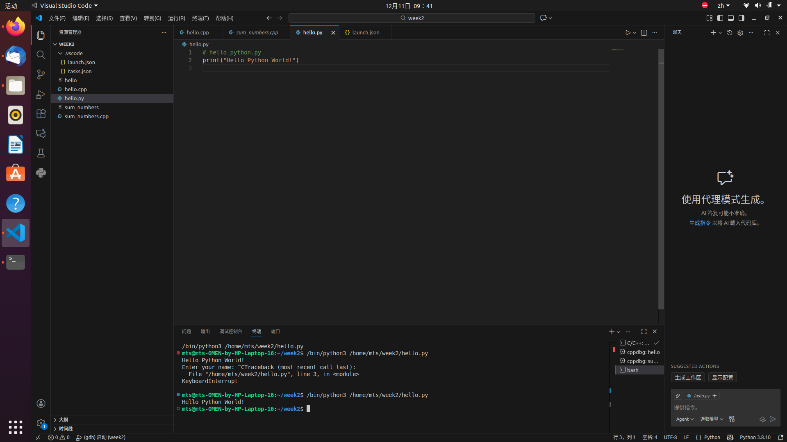

### 任务3: ROS1安装验证

#### 安装步骤
1. 按照官方教程安装 ROS Noetic
2. 配置环境变量和 rosdep
3. 验证核心功能是否正常

#### 验证结果
- roscore 成功启动
- rosnode list 显示正常节点列表
- ROS 环境变量配置正确
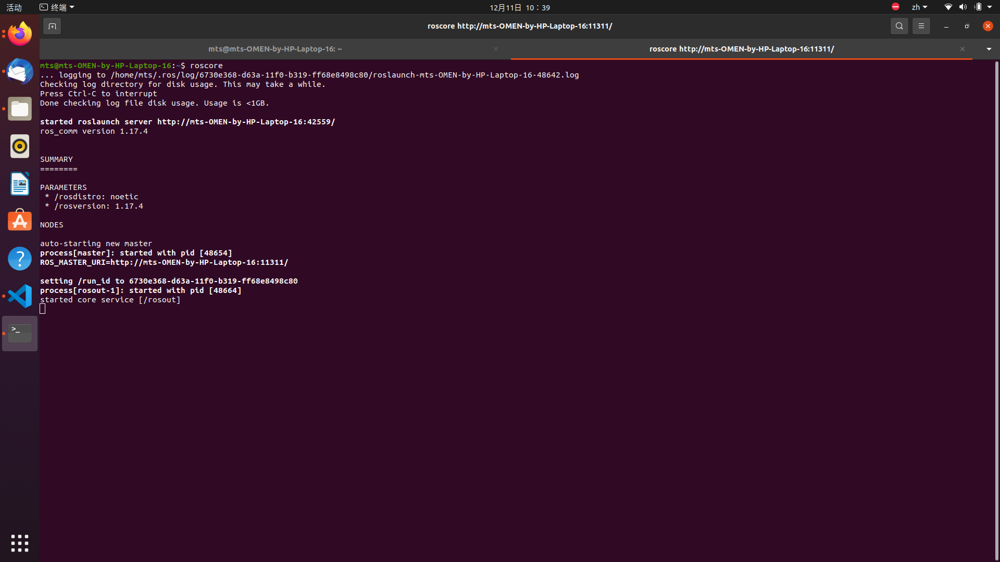
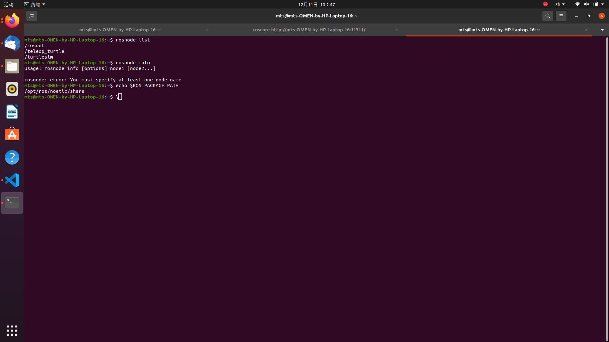
### 任务4: CATKIN工作空间与功能包

#### 实现内容
1. 创建 catkin 工作空间
2. 建立 beginner_tutorials 功能包
3. 编写 HelloWorld ROS 节点程序

#### 技术要点
- 理解 catkin 编译系统的工作机制
- 掌握 ROS 功能包的文件结构
- 实现基本的节点通信功能
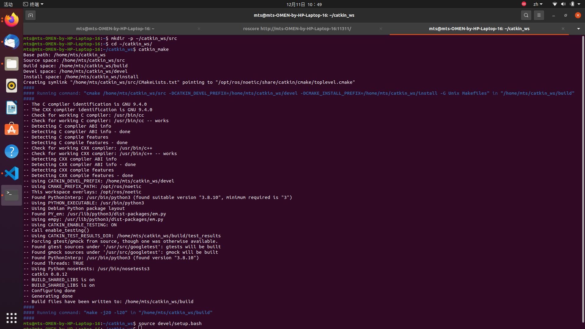
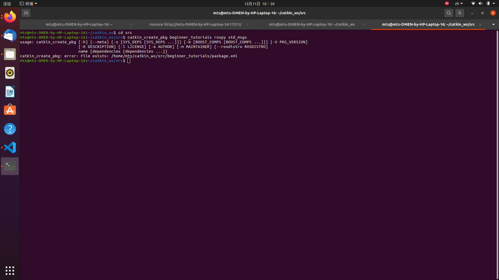
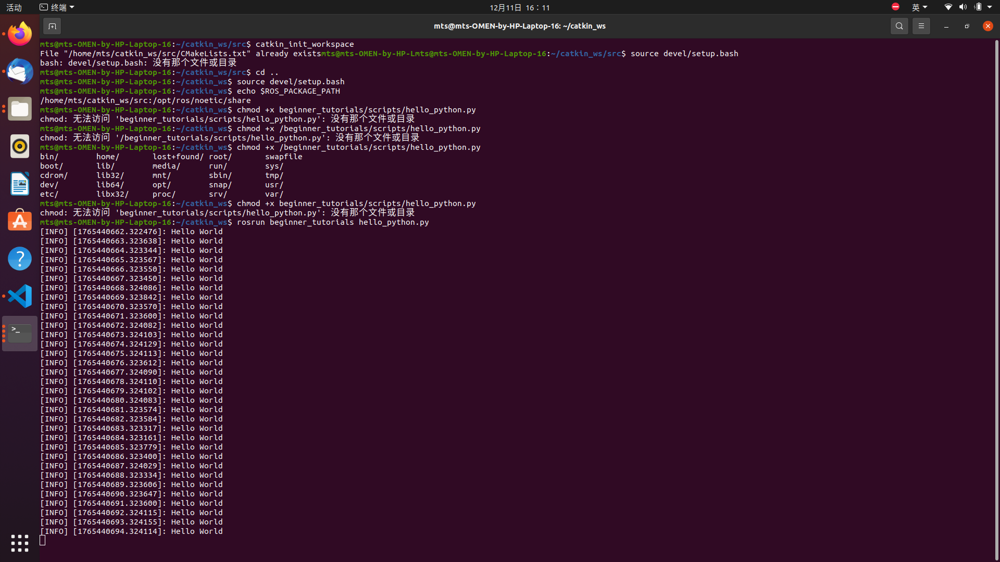
### 任务5: Turtlesim小乌龟控制

#### 控制方式
1. **键盘控制**：使用 turtle_teleop_key 进行手动控制
2. **命令行控制**：通过 rostopic pub 发布速度指令
3. **编程控制**：编写 Python 程序实现自动画圆

#### 学习成果
- 理解 ROS 话题通信机制
- 掌握 geometry_msgs/Twist 消息类型
- 能够通过编程实现机器人运动控制
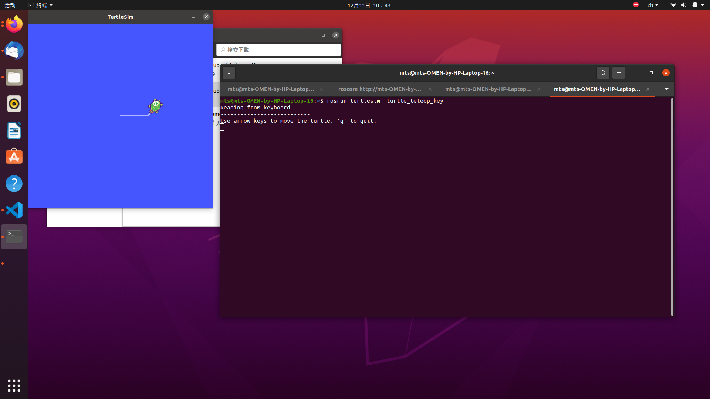
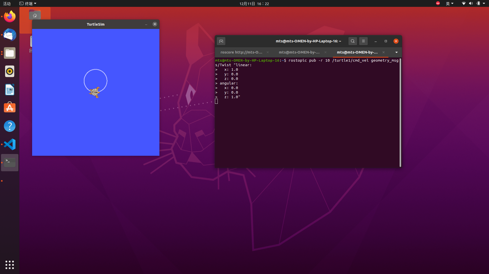
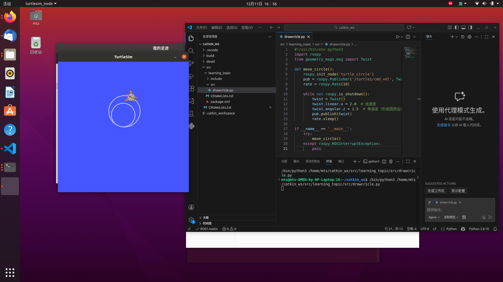
### 任务6: 多乌龟Launch文件

#### 系统设计
1. 创建多乌龟启动文件
2. 为每只乌龟配置独立命名空间
3. 实现话题重映射和独立控制

#### 高级特性
- launch 文件的编写和调试
- 命名空间管理和话题重映射
- 使用 rqt_graph
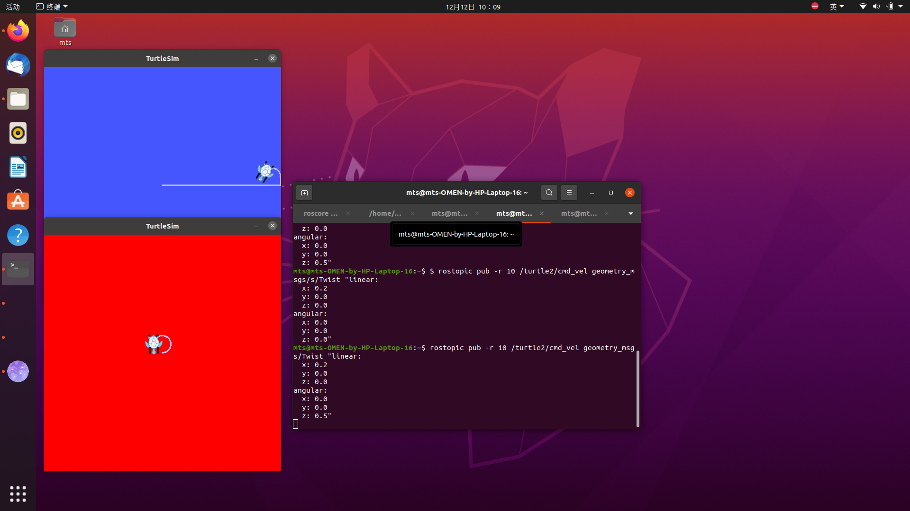

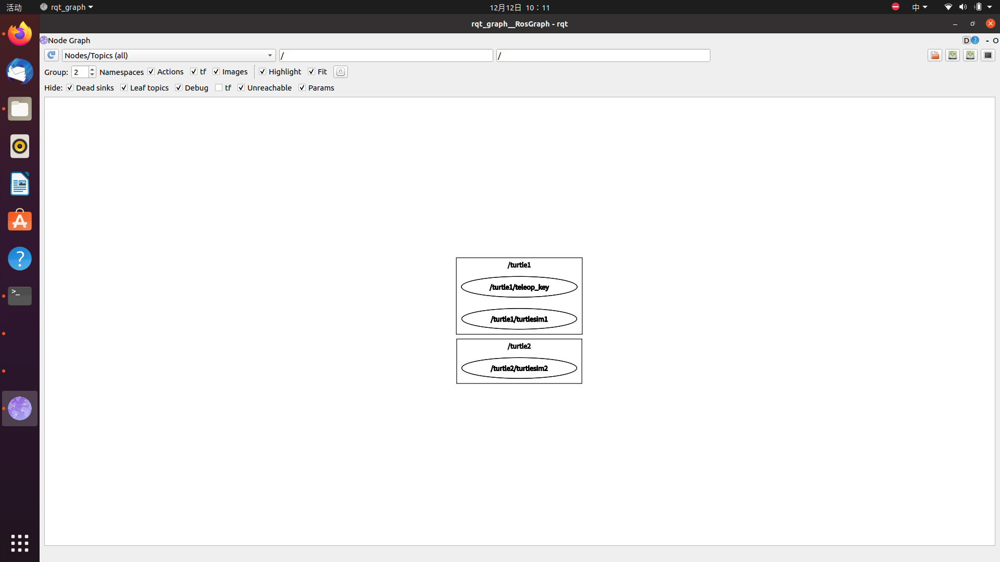
## 遇到的问题及解决方法

### 问题1: rostopic pub 命令格式错误
**问题描述**：执行 rostopic pub 命令时出现 YAML 解析错误

**解决方法**：使用正确的 YAML 格式，确保正确的缩进和引号使用，掌握 ROS 消息的命令行发布语法。

### 问题2: Python节点权限问题
**问题描述**：ROS Python 节点无法执行，提示权限拒绝

**解决方法**：为 Python 脚本添加可执行权限，理解 Linux 文件权限管理机制。

### 问题3: 功能包找不到
**问题描述**：编译后无法找到新创建的功能包

**解决方法**：正确设置工作空间 overlay，掌握 ROS 包管理机制。

## 实验心得

通过本周的实验，我深入掌握了 ROS 的基础知识和操作技能：

1. **Linux 操作系统**：熟练掌握了文件管理、软件安装和进程管理等基本操作，为后续开发打下坚实基础。

2. **开发环境配置**：成功配置了 Python 和 C++ 开发环境，理解了不同编程语言在 ROS 中的应用场景。

3. **ROS 核心概念**：通过实践深入理解了工作空间、功能包、节点、话题等核心概念，掌握了 ROS 的基本架构。

4. **通信机制**：通过 turtlesim 实例，直观理解了发布-订阅通信模式，能够通过编程和命令行两种方式控制机器人。

5. **高级特性**：掌握了 launch 文件、命名空间、重映射等高级功能，能够管理复杂的机器人系统。

6. **调试技能**：学会了使用 rqt_graph、rqt_plot 等工具进行系统调试和可视化分析。

本次实验让我对机器人操作系统有了全面的认识，为后续的机器人开发项目奠定了坚实的基础。特别是在解决实际问题过程中，提高了问题排查和解决的能力。通过理论与实践的结合，不仅掌握了技术知识，更培养了工程实践能力和系统思维能力。

---

**实验完成时间**：2025年12月12日  

